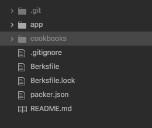

# Jenkins Development Environment

<div>
  
</div>

<p style="font-size: 18px;">This development environment was created to automatically spin up a dev environment with Jenkins installed onto it</p>

## Contents
---
- <a href="#what" style="font-size: 20px;"> What is Jenkins? </a>
- <a href="#how" style="font-size: 20px;"> How to use this development environment </a>
- <a href="#setup" style="font-size: 20px;"> Set up Jenkins </a>
---

<u><h2 id="what">What is Jenkins?</h2></u>

<p style="font-size: 18px;">
<a href="https://jenkins.io/">Jenkins</a> is a DevOps tool used to create Continuous Integration/Continuous Delivery/Continuous Deployment pipelines (CI/CD/CD). The key differences between the 3 pipelines are that:
  <ul style="font-size: 16px;">
    <li>CI - A pipeline that pulls the projects code from a version control systems development branch, tests it using the tests that the developer creates and (should they pass) pushes the code to the UAT/Live branch</li>  
    <li>CD(elivery) - Pulls code from the UAT branch and tests it on a UAT environment. From that UAT machine, if the tests pass, it is pushed to a live production environment.</li>  
    <li>CD(eployment) - Pulls code from the live branch and then deploys it on a live production environment straight away</li>
  </ul>
</p>

<p style="font-size: 18px;">
Jenkins also has several plugins to allow it to communicate with other services such as AWS, GitHub, Mercurial etc.
</p>

<p style="font-size: 18px;">
Jenkins builds are colour coded and can be customised to suit the needs of the developer using it. The default colours are:
  <ul style="font-size: 16px;">
    <li>Blue = Pass</li>
    <li>Red = Fail</li>
    <li>Grey = Build interrupted/Cancelled</li>
  </ul>
</p>

<u><h2 id="how">How to use this cookbook</h2></u>

### Initial preparation

1. <p style="font-size: 18px;">
Download and install <a href="https://www.vagrantup.com/">Vagrant 2.2.0</a>
</p>

2. <p style="font-size: 18px;">
Ensure that it is install by running:
</p>

```bash
vagrant -v
```
<p style="font-size: 18px;">
You should see:
</p>

```bash
Vagrant 2.2.0
```

3. <p style="font-size: 18px;">
Download and install <a href="https://www.virtualbox.org/wiki/Downloads">Oracle VirtualBox 5.2.20</a>
</p>

4. <p style="font-size: 18px;">
You will see the VirtualBox icon appear when it is installed properly
</p>

### Using the Jenkins cookbook using Berksfile

<p style="font-size: 18px;">
To use the <a href="https://github.com/RCollettSG/JenkinsCookbook">Jenkins cookbook</a> associated, Follow these initial steps:
</p>

1. <p style="font-size: 16px;"> Run this line in your console under the same directory it is in. </p>

```bash
  berks vendor cookbooks
```

2. <p style="font-size: 16px;"> If done correctly, a cookbooks directory should appear in the directory you are in, containing the beats cookbook. A Berksfile.lock should also appear. </p>



### After the above

1. <p style="font-size: 16px;"> Open console in administrator mode </p>

2. <p style="font-size: 16px;"> Run the vagrant setup: </p>

```bash
  vagrant up
```

3. <p style="font-size: 16px;"> SSH into the machine </p>

```bash
  vagrant ssh
```

4. <p style="font-size: 16px;"> Go to /var/lib/jenkins </p>

```bash
  cd /var/lib/jenkins
```

5. <p style="font-size: 16px;"> Change the permissions on the secrets folder to 700 </p>

```bash
  sudo chmod 700 secrets/
```


5. <p style="font-size: 16px;"> Go into the secrets folder and show the initialAdminPassword file</p>

```bash
  sudo cat initialAdminPassword
```

<u><h2 id="setup">Setup Jenkins</h2></u>

1. <p style="font-size: 16px;">Go to jenkins.local:8080</p>

2. <p style="font-size: 16px;">Copy and paste the initial admin password into the relevant text box</p>

3. <p style="font-size: 16px;">Choose how you want to install Jenkins</p>

4. <p style="font-size: 16px;">Setup a normal account, an admin account or both</p>

5. <p style="font-size: 16px;">Set your Jenkins URL</p>

6. <p style="font-size: 16px;">Welcome to Jenkins!</p>

---
